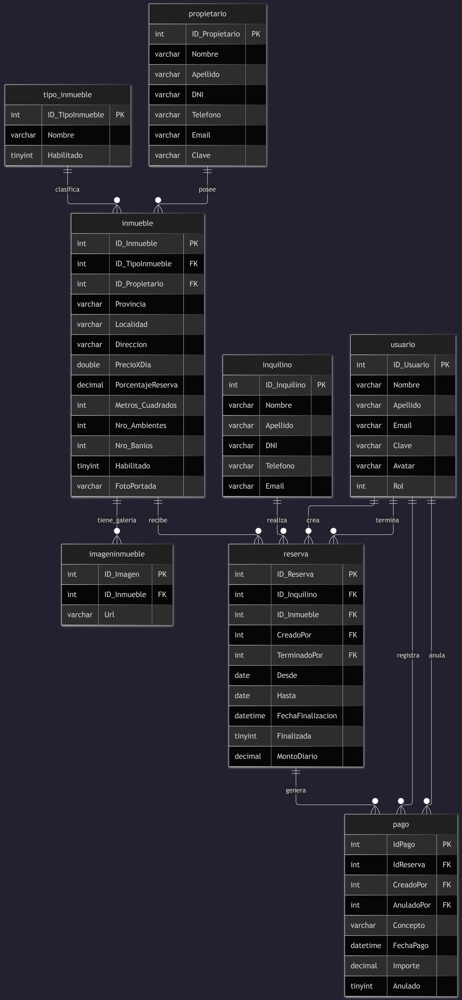
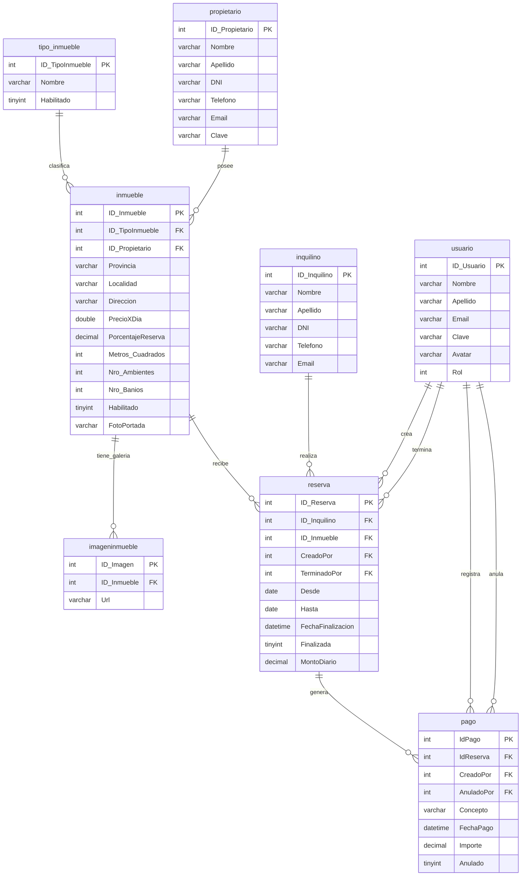

# Inmobiliaria Grupo 9

> Sistema de gestión inmobiliaria desarrollado en ASP.NET Core MVC, que permite administrar propietarios, inquilinos, inmuebles, reservas y pagos.

---

## 👥 Integrantes del Grupo

* **Juan Demetrio Abregu** - *abregu058@gmail.com* - [@usuario_github](https://github.com/AbreguJuan) - Discord: `Nedisane`
* **Luca Rodrigaño** - *Lucarodrigano@gmail.com* - [@usuario_github](https://github.com/Lucarod96) - Discord: `lucarod96`
* **Alfaro Milagros Gilda** - *milagrosalfaro225@gmail.com* - [@usuario_github](https://github.com/Milagros2109) - Discord: `Alfaro_225`

---

## 🛠️ Tecnologías

* **Backend:** ASP.NET Core MVC 8 (C#)
* **Seguridad:** Autenticación por Cookies, Criptografía (Pbkdf2 con Salt), y Autorización Basada en Roles (RBAC)
* **Base de datos:** MySQL
* **Conector:** MySqlConnector
* **Frontend:** Razor Views (.cshtml), HTML5, CSS3, Bootstrap

---

## 📐 Modelado de Datos

A continuación se presenta el esquema del modelo de datos correspondiente a la aplicación:

### Diagrama Entidad-Relación (DER)



<details>
<summary>Ver diagrama en código Mermaid</summary>



</details>

---

## 🚀 Cómo correr el proyecto

### Requisitos previos

* [.NET SDK](https://dotnet.microsoft.com/download) (versión 8 o superior)
* [MySQL Server](https://dev.mysql.com/downloads/mysql/) instalado y corriendo
* [MySQL Workbench](https://dev.mysql.com/downloads/workbench/) para gestionar la base de datos

### Pasos

1. **Cloná el repositorio**
   ```bash
   git clone https://github.com/AbreguJuan/inmobiliaria-grupo-9.git
   cd inmobiliaria-grupo-9
   ```

2. **Creá la base de datos**

   Corré el script de inicialización utilizando MySQL Workbench, o directamente desde la terminal asegurándote de apuntar a la carpeta `Database`:
   ```bash
   mysql -u root -p < Database/inmobiliariagrupo9.sql
   ```

3. **Configurá la cadena de conexión**

   En el archivo `appsettings.json`, completá la conexión con tus credenciales locales de MySQL:
   ```json
   {
     "ConnectionStrings": {
       "DefaultConnection": "Server=localhost;Database=inmobiliariagrupo9;User=root;Password=TU_CLAVE;"
     },
     "Salt": "TU_SALT_DE_SEGURIDAD"
   }
   ```

4. **Restaurá las dependencias y corré el proyecto**
   ```bash
   dotnet restore
   dotnet run
   ```

5. **Abrí el navegador** en la URL que indique la consola (por defecto suele ser `http://localhost:5173/`)

### 🔑 Credenciales de Prueba

Una vez que el proyecto esté corriendo, podés ingresar al sistema utilizando las siguientes cuentas que ya vienen incluidas en el script de la base de datos:

* **Rol Administrador (Acceso total):**
  * **Usuario:** `Admin@mail.com`
  * **Clave:** `1234`

* **Rol Empleado (Acceso restringido):**
  * **Usuario:** `Elliotalderson@mail.com`
  * **Clave:** `1234`

---

## 📂 Estructura del proyecto

```
inmobiliaria-grupo-9/
├── Controllers/           # Lógica de negocio (Propietarios, Inquilinos, Reservas, Pagos, Usuarios, Inmuebles)
├── Models/                # Entidades del dominio, LoginView y Repositorios (Patrón Repository)
├── Views/                 # Vistas Razor (.cshtml) estructuradas por controlador
├── wwwroot/               # Archivos estáticos, hojas de estilo y directorio de subida (Uploads/Avatares, images/inmuebles)
├── Database/              # Directorio con el script SQL (inmobiliariagrupo9.sql)
├── appsettings.json       # Configuración global de la aplicación
└── Program.cs             # Configuración de servicios, inyección de dependencias y middleware de autenticación
```

---

## ✅ Funcionalidades implementadas

### Gestión de Seguridad y Usuarios:

* Sistema de Login/Logout protegido mediante Cookie Authentication.

* Encriptación de contraseñas de alta seguridad utilizando Pbkdf2 y Salt.

* Control de Acceso Basado en Roles (RBAC):

    -Administrador: Permisos totales, incluyendo la eliminación definitiva/anulación de registros y auditoría.

    -Empleado: Gestión operativa diaria sin privilegios de eliminación, evitando pérdida de datos críticos.

* Perfil de usuario con subida y actualización dinámica de Avatar.

### Gestión de Inmuebles:

* ABM completo de propiedades y ABM de Tipos de Inmueble (Casa, Depto, etc.).

* Subida de imágenes: soporte para foto de portada y galería de imágenes múltiples.

* Buscador avanzado con filtros combinados (precio, m², cantidad de ambientes, disponibilidad por fechas y estado).

### Gestión de Reservas:

* Creación de reservas con validación estricta en tiempo real para evitar superposición de fechas en un mismo inmueble.

* Renovación de reservas existentes, enlazando automáticamente los nuevos períodos.

* Finalización anticipada de contratos con lógica de negocio integrada: calcula automáticamente los días restantes y aplica multas (50% o 25%) según el tiempo transcurrido.

### Gestión de Pagos:

* Creación, edición y listado de comprobantes asociados a cada reserva.

* Cálculo automático de "Seña" (porcentaje del valor total) al momento de asentar una nueva reserva.

* Auditoría de operaciones: el sistema registra de forma invisible qué usuario del sistema cobró o anuló un pago.

### Gestión de Propietarios e Inquilinos:

* Alta, Baja, Modificación y listado paginado.

* Buscador unificado por nombre, apellido, DNI, teléfono o email.
