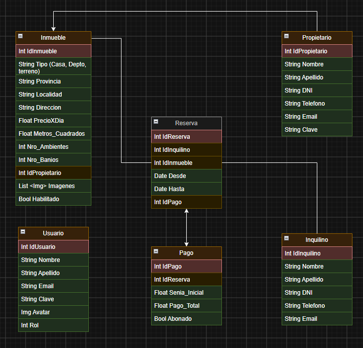
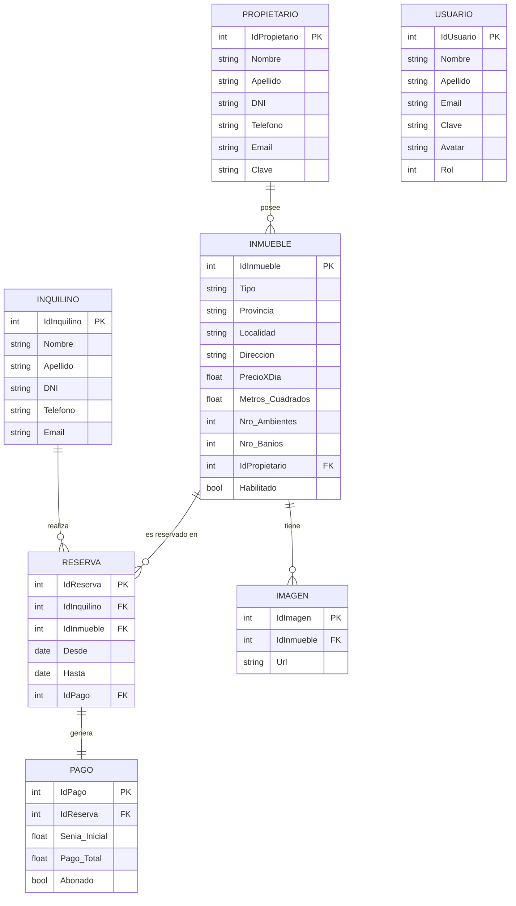

# Inmobiliaria Grupo 9

> Sistema de gestión inmobiliaria desarrollado en ASP.NET Core MVC, que permite administrar propietarios, inquilinos, inmuebles, reservas y pagos.

---

## 👥 Integrantes del Grupo

* **Juan Demetrio Abregu** - *abregu058@gmail.com* - [@usuario_github](https://github.com/usuario/AbreguJuan) - Discord: `Nedisane`
* **Luca Rodrigaño** - *Lucarodrigano@gmail.com* - [@usuario_github](https://github.com/Lucarod96) - Discord: `lucarod96`
* **Alfaro Milagros Gilda** - *milagrosalfaro225@gmail.com* - [@usuario_github](https://github.com/Milagros2109) - Discord: `Alfaro_225`

---

## 🛠️ Tecnologías

* **Backend:** ASP.NET Core MVC (C#)
* **Base de datos:** MySQL
* **Conector:** MySqlConnector
* **Frontend:** Razor Views (cshtml), Bootstrap

---

## 📐 Modelado de Datos

A continuación se presenta el esquema del modelo de datos correspondiente a la aplicación:

### Diagrama Entidad-Relación (DER)



> **Nota:** Subí la imagen del diagrama a una carpeta `/docs` en el repositorio y enlazala como se muestra arriba.

<details>
<summary>Ver diagrama en código Mermaid (Opcional)</summary>



</details>

---

## 🚀 Cómo correr el proyecto

### Requisitos previos

* [.NET SDK](https://dotnet.microsoft.com/download) (versión 8 o superior)
* [MySQL Server](https://dev.mysql.com/downloads/mysql/) instalado y corriendo
* (Opcional) [MySQL Workbench](https://dev.mysql.com/downloads/workbench/) para gestionar la base de datos

### Pasos

1. **Cloná el repositorio**
   ```bash
   git clone https://github.com/AbreguJuan/inmobiliaria-grupo-9.git
   cd inmobiliaria-grupo-9
   ```

2. **Creá la base de datos**

   Corré el script `script.sql` (ubicado en `/Database`) en MySQL Workbench, o desde la terminal:
   ```bash
   mysql -u root -p < Database/script.sql
   ```

3. **Configurá la cadena de conexión**

   En `appsettings.json`, completá con tus datos de MySQL:
   ```json
   {
     "ConnectionStrings": {
       "DefaultConnection": "Server=localhost;Database=inmobiliariagrupo9;User=root;Password=TU_CLAVE;"
     }
   }
   ```

4. **Restauré las dependencias y corré el proyecto**
   ```bash
   dotnet restore
   dotnet run
   ```

5. **Abrí el navegador** en la URL que indique la consola (por ejemplo `http://localhost:5173/`)

---

## 📂 Estructura del proyecto

```
inmobiliaria-grupo-9/
├── Controllers/        # Controladores MVC (Propietario, Inquilino, Home, etc.)
├── Models/              # Entidades, interfaces de repositorio e implementaciones
├── Views/               # Vistas Razor (.cshtml) organizadas por controlador
├── wwwroot/             # Archivos estáticos (CSS, JS, imágenes)
├── Database/            # Script SQL de creación de la base de datos
├── appsettings.json     # Configuración (connection string, etc.)
└── Program.cs           # Punto de entrada de la aplicación
```

---

## ✅ Funcionalidades implementadas

- [x] ABM completo de Propietarios
- [x] ABM completo de Inquilinos
- [ ] ABM de Inmuebles
- [ ] Gestión de Reservas
- [ ] Gestión de Pagos
- [ ] Sistema de Usuarios y roles
